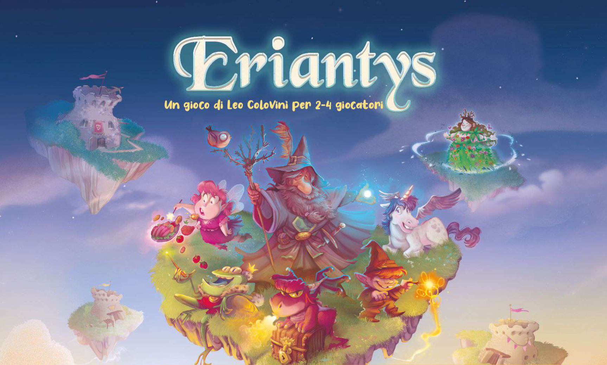

# Prova finale di ingegneria del software - AA 2021-2022



Eriantys Board Game is the final test of **"Software Engineering"**, course of **"Computer Science Engineering"** held at Politecnico di Milano (2021/2022).

## Project specification
The project consists in a Java version of the board game [Eriantys](https://www.craniocreations.it/prodotto/eriantys/), made by Leo Colovini.

We implemented this board game using according to the MVC (Model-View-Controller) pattern, using a single server able to handle one single match at a time and multiple clients, who can participate one only match per time. The network is mangaed with the use of sockets.

It is possible to choose between CLI (Command Line Interface) and GUI (Graphical User Interface)

## Implemented Functionalities
| Functionality | Status |
|:-----------------------|:------------------------------------:|
| Basic rules | [✅]() |
| Complete rules | [✅]() |
| Socket |[✅]() |
| CLI |[✅]() |
| GUI | [✅]() |
| 12 Character Cards | [✅]() |
| Persistence | [✅]() |
| Match 4 Players | [⛔]() |
| Multiple games | [⛔]() |
| Connection resilience | [⛔]() |
#### Legend
[⛔]() Not Implemented &nbsp;&nbsp;&nbsp;&nbsp;[⚠️]() Implementing&nbsp;&nbsp;&nbsp;&nbsp;[✅]() Implemented

## Documentation

### UML

In the [UML directory](https://github.com/lups2000/ing-sw-2022-Luppi-Lussana-Muralidaran/tree/main/deliverables/UML) can be found all our UML diagrams including: 
- the initial UML class diagram of the whole project
- the initial sequence diagram with the network protocol documentation
- the final UML class diagram only of the model (generated with the help of Intellij)
- the final UML class diagram only of the controller (generated with the help of Intellij)
- the final UML class diagram only of the view (generated with the help of Intellij)
- the final UML class diagram only of the network (generated with the help of Intellij)
- the final UML class diagram of the whole project (generated with the help of Intellij)


Whereas in the [peer reviews directory](https://github.com/lups2000/ing-sw-2022-Luppi-Lussana-Muralidaran/tree/main/deliverables/peer%20reviews) can be found all the peer reviews, the ones that we made and the ones that we received by other groups. 


### Coverage report
We use JUNIT5 to test our components, in particular we focused a lot on the Model covering about the 90% of its code. 
On the other hand the controller was difficult to test because of the network messages.


### Jars
We generated two pre-compiled jar file, one for the server and one for the client and they can be downloaded at the following link: [Jars](https://github.com/lups2000/ing-sw-2022-Luppi-Lussana-Muralidaran/tree/main/deliverables/jar).


## Execution
In order to execute this project correctly a Java version 17 (or followings) is required.
To execute the jars files is required to be placed in the deliverables/jar directory of this repository.

### Server
In order to launch the server you have to digit in your command prompt the following command: 
```
java -jar PSP24-Server.jar
```
The first thing you will be asked is if you want to change the port number by writing it, we use the default value of __12345__

### Client
In order to launch the client you have to digit in your command prompt the following command: 
```
java -jar PSP24-Client.jar
```
The first thing you will be asked is if you want to launch the CLI or the GUI, by writing respectively a 'c' or a 'g'.


## Group components
- [__Matteo Luppi__](https://github.com/lups2000)
- [__Lussana Paolo__](https://github.com/paololussa)
- [__Pradeeban Muralidaran__](https://github.com/DarthPrader00)
